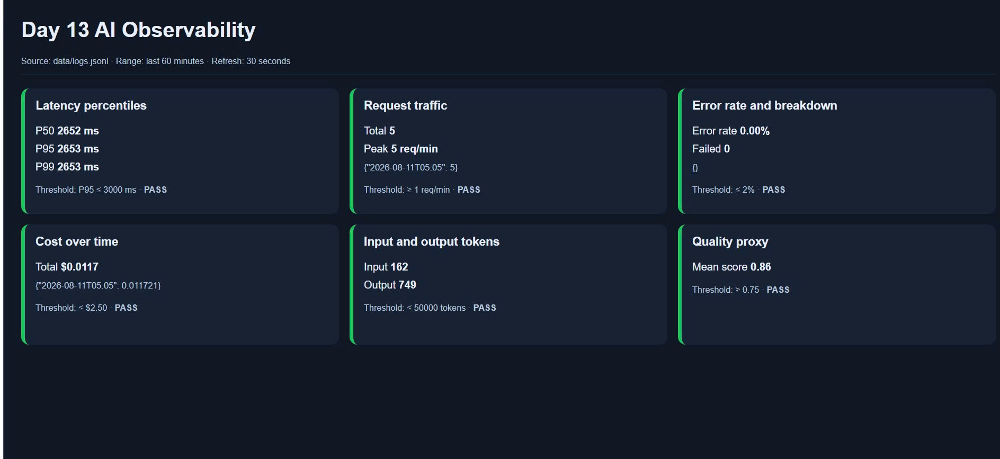
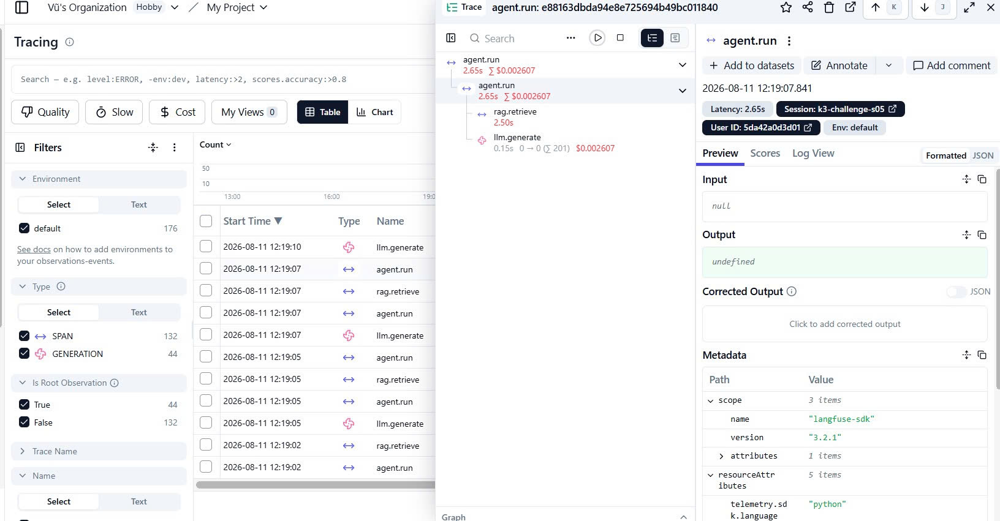
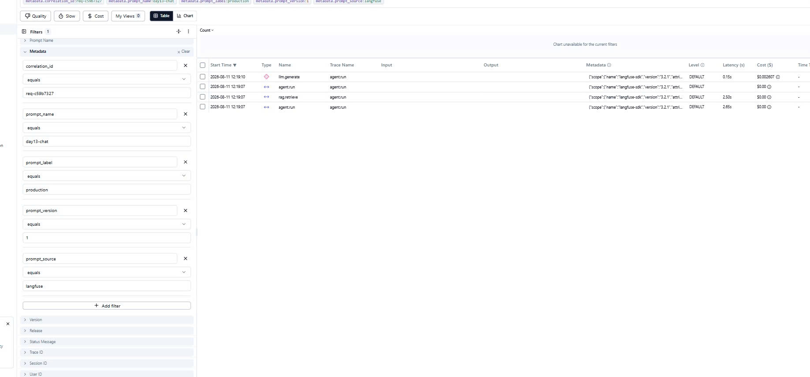

# Báo cáo Day 13 Observability

## 1. Thông tin nhóm

- Tên nhóm: K3 — E403-C42
- Repository URL: https://github.com/ducTin25/Day13-K3-Observability-E403-C42
- Commit SHA chốt nội dung trước final-delivery commit: `49ab8c763d6e97bd881c6b6a011214c656921ba6`. SHA nộp chính thức là HEAD mới nhất của `main` sau commit hoàn thiện report/evidence và được ghi trên Codelabs.
- Thành viên và vai trò:
  - Cao Nhật Minh — 2A202601721 — API, middleware và structured logging.
  - Nguyễn Nam Anh — 2A202601703 — Security Engineer, PII scrubbing.
  - Dương Văn Vũ — 2A202601663 — Metrics và dashboard.
  - Trần Anh Thư — 2A202601611 — SLO, alerts và runbook.
  - Nguyễn Đức Tín — 2A202601185 — QA & Chief Investigator.

## 2. Kết quả kỹ thuật

- Điểm `validate_logs.py`: baseline CP0 `30/100`, sau CP1–CP3 đạt `100/100`; clean-run cuối bằng lệnh mặc định ghi nhận 20 records, 10 correlation IDs, không thiếu required field/enrichment và không phát hiện PII leak. Xem [`evidence/final-validation.txt`](evidence/final-validation.txt); evidence CP2 được lưu tại [`evidence/cp2-validate-logs.txt`](evidence/cp2-validate-logs.txt).
- Tổng số traces: Ít nhất 43 traces trên Langfuse sau CP3; CP2 có 20 traces baseline/practice trong [`evidence/cp2-tracing-evidence.md`](evidence/cp2-tracing-evidence.md), CP3 có thêm 15 traces official baseline/challenge/recovery trong [`evidence/cp3-e-investigation.md`](evidence/cp3-e-investigation.md), cộng các trace prompt candidate/production.
- Số PII leak còn lại: `0` theo validator, bộ test PII/security và audit challenge của B.
- Link/đường dẫn dashboard: Contract tại [`../config/dashboard.yaml`](../config/dashboard.yaml); runtime snapshot gồm [baseline HTML](evidence/cp2-dashboard-baseline.html), [practice incident HTML](evidence/cp2-dashboard-rag-slow.html), [official challenge HTML](evidence/cp3-challenge-dashboard.html), [bảng tổng hợp](evidence/cp2-dashboard-summary.md) và [ảnh dashboard 6 panel](evidence/dashboard.jpg).

## 3. Logging và tracing

- Evidence correlation ID: [`evidence/cp2-baseline-logs.jsonl`](evidence/cp2-baseline-logs.jsonl), [`evidence/cp2-correlation-log.txt`](evidence/cp2-correlation-log.txt) và [`evidence/cp3-e-correlation-logs.jsonl`](evidence/cp3-e-correlation-logs.jsonl) chứng minh `request_received`/`response_sent` có thể nối với trace bằng cùng `correlation_id` và metadata request.
- Evidence PII redaction: Chi tiết tại [`evidence/pii-security-report.md`](evidence/pii-security-report.md); clean log có `[REDACTED_EMAIL]`, `[REDACTED_PHONE_VN]`, `[REDACTED_CREDIT_CARD]`, `[REDACTED_PASSPORT]`, `[REDACTED_ADDRESS_VN]` và `user_id_hash`; validator báo `Potential PII leaks detected: 0`.
- Evidence trace waterfall: [`evidence/cp2-tracing-evidence.md`](evidence/cp2-tracing-evidence.md) chứng minh waterfall `agent.run → rag.retrieve` và `agent.run → llm.generate`.
- Giải thích một span đáng chú ý: Với trace practice `140deeeeacae5bbc21e7a21f3b88c876`, `rag.retrieve` mất 2.501 s trên tổng 2.652 s của agent (~94%), trong khi `llm.generate` giữ 0.151 s. Baseline tương ứng có RAG ~0 s và LLM 0.151 s.
- Evidence official challenge: trace `aabc9cc147c22bb125c682479ca03eb2` nối với log bằng `req-9d336808`; RAG mất 2.501 s trên tổng 2.652 s, trong khi recovery trace `8014cca2270ada556ea2b9f9d59c700f` có RAG 0 s và agent 0.151 s.

## 4. Prompt versioning

- Prompt name: `day13-chat` theo prompt contract và cấu hình mặc định của ứng dụng.
- Version/label baseline: Version 1 — labels `baseline`, `production` sau rollback.
- Version/label candidate: Version 2 — labels `candidate`, `latest`.
- Trace ID của mỗi version: baseline v1 `bb19d78c2d1aa24c8731801f6b809615`; candidate v2 `6d4e75fcb32c66ca2d4bf984d1cc9e30`; production v2 `1984d5d04a8c6e13d0bb44ea6bd208e2`; production rollback v1 `28b8becb0b8d543b3fa2663011b90a70`.
- Bằng chứng đổi label hoặc rollback: [`evidence/cp2-prompt-versioning.md`](evidence/cp2-prompt-versioning.md) ghi nhận production được promote sang v2, tạo trace thật, sau đó rollback về v1 và tạo trace xác minh.
- Ảnh Langfuse production v1: [`evidence/trace-prompt-v1-production.jpg`](evidence/trace-prompt-v1-production.jpg); v2 và rollback được kiểm chứng bằng các trace ID/API evidence ở trên.

## 5. Dashboard, SLO và alerts

- Kết quả `validate_dashboard.py`: `HỢP LỆ: 6/6 panel có trong dashboard contract`; xem [`evidence/cp0-dashboard-validator.txt`](evidence/cp0-dashboard-validator.txt).
- Evidence dashboard: [baseline HTML](evidence/cp2-dashboard-baseline.html), [practice incident HTML](evidence/cp2-dashboard-rag-slow.html), [official challenge HTML](evidence/cp3-challenge-dashboard.html), [bảng đối chiếu CP2](evidence/cp2-dashboard-summary.md) và [metric handoff CP3 của C](evidence/cp3-role-c-metrics.md).
- SLO đã chọn và lý do:
  - Latency P95 ≤ 3000 ms, dùng percentile để quan sát tail latency thay vì average.
  - Error rate ≤ 2% để bảo vệ tỷ lệ request thành công.
  - Chi phí ≤ 2.5 USD trong khoảng đánh giá của lab.
  - Quality score trung bình ≥ 0.75; E là owner của quality signal.
  - Production window là 28 ngày; trong lab dùng toàn bộ log của phiên demo/load test làm proxy do traffic giới hạn.
- Alert rules và runbook: Hoàn thành — 4 symptom-based alert (latency P95, error rate, quality, cost) trong [`../config/alert_rules.yaml`](../config/alert_rules.yaml), runbook đầy đủ (SLI/SLO, điều kiện, 3 bước Metrics→Traces→Logs, mitigation/rollback, escalation, điều kiện đóng/verify recovery) trong [`../docs/alerts.md`](../docs/alerts.md). Không hard-code tên incident làm điều kiện alert.

## 6. Điều tra challenge

- Challenge ID: `day13-k3-observability-v1`.
- Phạm vi challenge: incident `rag_slow`, affected feature `refund`, latency threshold `2000 ms`.
- Triệu chứng từ metrics: Lượt chạy dashboard/runbook của C/D ghi nhận P95 `6153 ms`, vượt SLO `3000 ms`; lượt trace-controlled của E với cùng 5 official queries/concurrency 5 ghi nhận P95 tăng từ baseline `1414 ms` lên `2652 ms`, vượt threshold challenge `2000 ms`. Cả hai lượt đều có error rate `0.0%` và quality mean `0.86`, nên chỉ tín hiệu latency suy giảm. Xem [`evidence/cp3-challenge-investigation.md`](evidence/cp3-challenge-investigation.md), [`evidence/cp3-role-c-metrics.md`](evidence/cp3-role-c-metrics.md) và [`evidence/cp3-e-investigation.md`](evidence/cp3-e-investigation.md).
- Trace ID liên quan: challenge `aabc9cc147c22bb125c682479ca03eb2`; baseline đối chiếu `b4035f64539e20deb42aef06fd2a60aa`; recovery `8014cca2270ada556ea2b9f9d59c700f`.
- Log line/correlation ID liên quan: trace challenge nối với `req-9d336808`, có feature `refund` và latency `2651 ms`. Lượt C/D còn ghi nhận `req-933d8fb6`, `req-140f2201`, `req-a0aa5316`, `req-8f4be8c3`, `req-13e9d431`; xem [`evidence/cp3-e-correlation-logs.jsonl`](evidence/cp3-e-correlation-logs.jsonl) và [`evidence/cp3-challenge-logs.jsonl`](evidence/cp3-challenge-logs.jsonl).
- Root cause: Runtime trace localize độ trễ vào RAG retrieval: `rag.retrieve` chiếm `2.501/2.652 s` (~94%), trong khi `llm.generate` giữ `0.151 s`, token count bình thường, request không lỗi và quality không giảm. Source được đọc sau bước Metrics → Traces → Logs xác nhận incident chèn delay RAG toàn cục; feature `refund` là phạm vi workload challenge, không phải điều kiện giới hạn incident.
- Fix action: Đã gọi endpoint disable để khôi phục RAG bình thường. Hướng production là retrieval timeout kết hợp cache/fallback an toàn khi dependency vượt latency budget.
- Preventive measure: Alert RAG span P95 theo feature; giữ trace-log correlation; pre-warm/cache prompt để giảm synchronous fetch overhead; dùng windowed metrics để alert tự phản ánh recovery; theo dõi timeout/fallback count; và làm rõ feature scope của incident.
- Recovery verification: Lượt E chạy lại cùng 5 official query/concurrency cho P95 `151 ms`, RAG span `0 s`, agent `0.151 s`; lượt D chạy 10 request sau disable cho P95 `1200 ms`. Cả hai đều dưới SLO `3000 ms` và error rate vẫn `0.0%`.

## 7. Đóng góp cá nhân

Với mỗi thành viên, ghi rõ nhiệm vụ và link commit/PR tương ứng.

| Thành viên | Phần việc CP0–CP3 và delivery | Commit/PR kiểm chứng | Điều đã học |
| ---------- | ---------------------------- | ------------------- | ----------- |
| A — Cao Nhật Minh `2A202601721` | **CP0:** kiểm tra API/log baseline. **CP1:** hoàn thiện `CorrelationIdMiddleware`, kiểm tra/sinh `x-request-id`, bind `user_id_hash`, `session_id`, `feature`, `model`, `env`; chuẩn hóa exception handling và chống context leakage/double-count error. **CP2:** bàn giao lifecycle event cho metrics và correlation ID cho trace; kiểm chứng API/log tích hợp. **CP3:** cung cấp clean log, correlation/response evidence và bổ sung `--base-url` cho incident runner để tái hiện trên môi trường cô lập. | CP0–1: [`5bea088`](https://github.com/ducTin25/Day13-K3-Observability-E403-C42/commit/5bea088), [PR #3](https://github.com/ducTin25/Day13-K3-Observability-E403-C42/pull/3) CP2: [`5d87342`](https://github.com/ducTin25/Day13-K3-Observability-E403-C42/commit/5d87342), [PR #8](https://github.com/ducTin25/Day13-K3-Observability-E403-C42/pull/8) CP3: [`56b4947`](https://github.com/ducTin25/Day13-K3-Observability-E403-C42/commit/56b4947), [PR #16](https://github.com/ducTin25/Day13-K3-Observability-E403-C42/pull/16) | Correlation ID chỉ hữu ích khi được giữ nhất quán qua header, body, log và trace. `contextvars` phải được clear/bind đúng vòng đời để an toàn khi concurrent request; lỗi cần được log/đếm đúng một lần và response không lộ nội bộ. |
| B — Nguyễn Nam Anh `2A202601703` | **CP0:** lập threat model và bộ PII synthetic. **CP1:** bổ sung email, phone VN, CCCD, card, passport, address patterns; đăng ký `scrub_event` đệ quy trước JSON renderer; hash `user_id`; thêm positive/negative tests. **CP2:** audit preview/metadata Langfuse và log nguồn dashboard, bảo đảm không capture raw input/output. **CP3:** audit challenge logs/evidence, xác nhận 0 leak và bàn giao báo cáo security. | CP0–1: [`c67b7d8`](https://github.com/ducTin25/Day13-K3-Observability-E403-C42/commit/c67b7d8), [PR #6](https://github.com/ducTin25/Day13-K3-Observability-E403-C42/pull/6) CP2: [`73b7c3f`](https://github.com/ducTin25/Day13-K3-Observability-E403-C42/commit/73b7c3f) Security handoff: [`3debcf5`](https://github.com/ducTin25/Day13-K3-Observability-E403-C42/commit/3debcf5) CP3: [`84d4c53`](https://github.com/ducTin25/Day13-K3-Observability-E403-C42/commit/84d4c53), [PR #15](https://github.com/ducTin25/Day13-K3-Observability-E403-C42/pull/15) | PII phải được scrub trước khi render/write và phải xử lý cả nested data. Regex cần cân bằng coverage với false positive để không phá correlation ID, latency, token hay trace metadata; trace privacy không tự động được bảo vệ bởi log scrubber. |
| C — Dương Văn Vũ `2A202601663` | **CP0:** baseline metrics, mapping event/field và dashboard validator. **CP1:** chốt `error_rate_pct = failed / total attempts × 100`, xử lý mẫu số 0 và error breakdown; kiểm chứng metrics API. **CP2:** dựng dashboard runtime đủ 6 panel từ JSONL, có time range/refresh/unit/threshold; đối chiếu baseline với practice incident. **CP3:** chạy official challenge, bàn giao P95/time window, dashboard và các correlation ID bất thường cho E. | CP0–1: [`7f8a4b3`](https://github.com/ducTin25/Day13-K3-Observability-E403-C42/commit/7f8a4b3), [`96926c5`](https://github.com/ducTin25/Day13-K3-Observability-E403-C42/commit/96926c5), [PR #7](https://github.com/ducTin25/Day13-K3-Observability-E403-C42/pull/7) CP2: [`3d8296e`](https://github.com/ducTin25/Day13-K3-Observability-E403-C42/commit/3d8296e), [PR #11](https://github.com/ducTin25/Day13-K3-Observability-E403-C42/pull/11) CP3: [`a98956a`](https://github.com/ducTin25/Day13-K3-Observability-E403-C42/commit/a98956a), [PR #13](https://github.com/ducTin25/Day13-K3-Observability-E403-C42/pull/13) | Percentile phản ánh tail latency tốt hơn average; error rate phải có mẫu số và lifecycle event nhất quán. Dashboard contract pass chưa đủ — số liệu runtime phải được đối chiếu với JSONL và metrics chỉ phát hiện triệu chứng, không tự kết luận root cause. |
| D — Trần Anh Thư `2A202601611` | **CP0–1:** xác định service boundary, SLI source/owner và SLO latency, error, cost, quality; ghi rõ lab window so với production 28 ngày. **CP2:** hoàn thiện 4 symptom-based alert, severity, sustain window, owner/escalation và runbook Metrics → Traces → Logs, mitigation/rollback/close condition. **CP3:** áp dụng alert/runbook cho official challenge, đánh giá user impact, đề xuất mitigation/preventive measures và xác minh recovery. | CP0–1: [`73ad7be`](https://github.com/ducTin25/Day13-K3-Observability-E403-C42/commit/73ad7be), [PR #2](https://github.com/ducTin25/Day13-K3-Observability-E403-C42/pull/2) CP2: [`c76db70`](https://github.com/ducTin25/Day13-K3-Observability-E403-C42/commit/c76db70), [PR #10](https://github.com/ducTin25/Day13-K3-Observability-E403-C42/pull/10) CP3: [`4ad993a`](https://github.com/ducTin25/Day13-K3-Observability-E403-C42/commit/4ad993a), [PR #14](https://github.com/ducTin25/Day13-K3-Observability-E403-C42/pull/14) | Alert nên bảo vệ triệu chứng người dùng/SLO thay vì hard-code implementation. Sustain window, minimum traffic và escalation giúp tránh flapping; incident chỉ được đóng sau khi workload sau mitigation chứng minh metric phục hồi. |
| E — Nguyễn Đức Tín `2A202601185` | **CP0:** lập QA test plan, chạy health/tests/load baseline concurrency 1/5 và bảo vệ challenge integrity. **CP1:** kiểm chứng correlation propagation, concurrent context, PII redaction, exception safety và clean-log validator. **CP2:** tạo waterfall `agent.run → rag.retrieve/llm.generate`, gắn token/cost/model/correlation metadata; tạo 20+ traces; sở hữu prompt v1/v2, promote/rollback và trace-log evidence. **CP3:** điều tra official challenge theo Metrics → Traces → Logs, xác định RAG chiếm ~94% latency, đề xuất fix/preventive measures, chạy recovery cùng workload và tổng hợp report/evidence toàn nhóm. | CP0: [`55e43e7`](https://github.com/ducTin25/Day13-K3-Observability-E403-C42/commit/55e43e7), [PR #1](https://github.com/ducTin25/Day13-K3-Observability-E403-C42/pull/1) CP1: [`a6ab966`](https://github.com/ducTin25/Day13-K3-Observability-E403-C42/commit/a6ab966), [PR #9](https://github.com/ducTin25/Day13-K3-Observability-E403-C42/pull/9) CP2: [`e86b968`](https://github.com/ducTin25/Day13-K3-Observability-E403-C42/commit/e86b968), [PR #12](https://github.com/ducTin25/Day13-K3-Observability-E403-C42/pull/12) CP3: [`477c854`](https://github.com/ducTin25/Day13-K3-Observability-E403-C42/commit/477c854), [PR #17](https://github.com/ducTin25/Day13-K3-Observability-E403-C42/pull/17) | Điều tra nên đi từ phạm vi rộng đến hẹp: metrics phát hiện, traces khoanh vùng, logs xác nhận context. Prompt version phải đến từ Langfuse thật; correlation ID là khóa nối service/trace/log; recovery cần cùng workload thay vì chỉ kiểm tra incident flag. |
